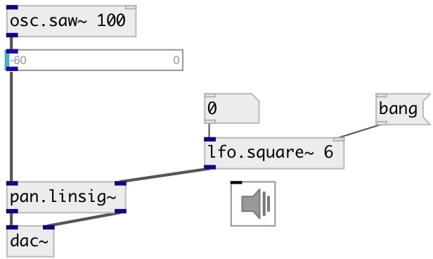

[index](index.html) :: [lfo](category_lfo.html)
---

# lfo.square~

###### Zero-mean unit-amplitude low frequency square wave

*available since version:* 0.1

---

## arguments:

* **freq**
frequency 
_type:_ float 
_units:_ Hz 

## methods:

* **reset**
reset to initial state 

## properties:

* **@active** 
Get/set on/off dsp processing 
_type:_ int 
_enum:_ 0, 1 
_default:_ 1 

* **@pause** 
Get/set pause oscillator at current value 
_type:_ int 
_enum:_ 0, 1 
_default:_ 0 

* **@phase** 
Get/set initial phase 
_type:_ float 
_range:_ 0..1 
_default:_ 0 

## inlets:

* frequency in Hz 
_type:_ audio
* reset phase 
_type:_ control

## outlets:

* output signal 
_type:_ audio

## keywords:

[lfo](keywords/lfo.html)
[oscillator](keywords/oscillator.html)
[square](keywords/square.html)

**See also:**
[\[lfo.+square~\]](lfo.%2Bsquare~.html)
[\[lfo.impulse~\]](lfo.impulse~.html)
[\[lfo.tri~\]](lfo.tri~.html)

**Authors:** Serge Poltavsky

**License:** GPL3 or later

