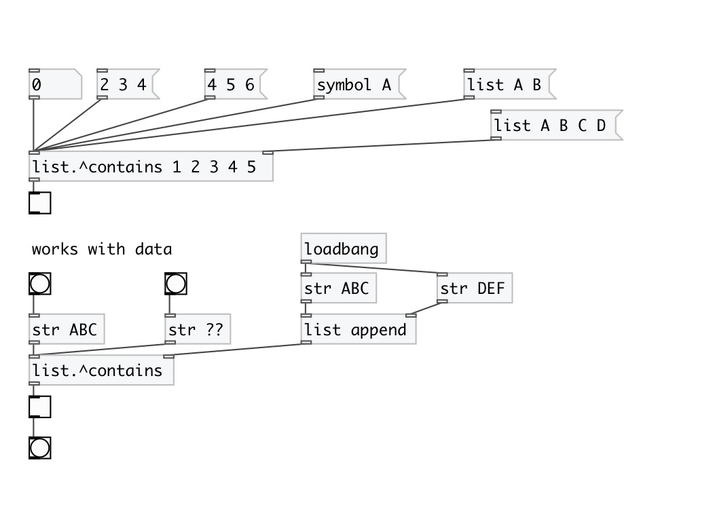
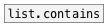
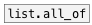
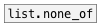

[< reference home](index.html)
---

# list.^contains

on input atom or list checks if specified list contains it

---

Outputs 1 if contains, otherwise 0
Different arguments order then in [list.^contains]
 

---

---
arguments:

---
properties:

---
see also: 

