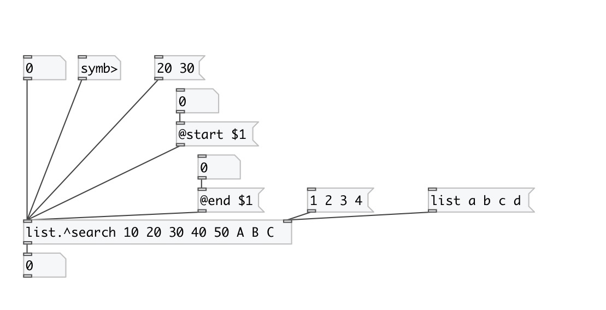

[< reference home](index.html)
---

# list.^search

on input atom returns it index in list

---

Outputs index or -1 if not found
 

---

---
arguments:

---
properties:

@start: search start index
            position 
@end: search end index position
            (-1 means end of list) 

---
see also: 

