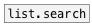
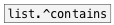

# list.^search

```


[F]  [S]    [20 30(
|    |      |
|    |      | [F]
|    |      | |
|    |      | [@start $1(
|    |      | |
|    |      | | [F]
|    |      | | |
|    |      | | [@end $1( [1 2 3 4(  [list a b c d(
|    |      | | |         |.         |.
[list.^search        10 20 30 40 50 A B C]
|
[F]

            
```
---
arguments:


---
properties:

@start: search start index
            position<br>
@end: search end index position
            (-1 means end of list)<br>

see also:<br>



