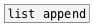

[<<< reference home](ceammc_lib.md)
---

# list.append

```


[B] [F]  [B]    [1 2 3 4 5( [B]
|   |    |             |    |
|   |    [str test1]   |    [str ANOTHER STRING]
|   |    |             |    |
|   |    |             |    |.
[list.append @prop ABC       ]
|
[ui.display @display_type=1]

            
```
---
append atom or list to the end of input list
---
arguments:


---
properties:


---
see also:<br>
[](list append.md)
