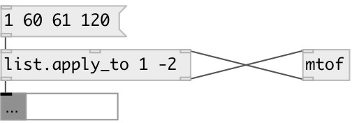

[index](index.html) :: [list](category_list.html)
---

# list.apply_to

###### modifies list value at specified position, filtering it via external object

*available since version:* 0.1

---

## arguments:

* **INDEXES**
apply index(es) (starting from 0). Negative value means position from end of
the list. For example: &#39;-1&#39; means last element. 
_type:_ list 

## properties:

* **@indexes** 
Get/set applied index(es) 
_type:_ list 

## inlets:

* Input list. If no element found by specified index - list passed without changes 
_type:_ control
* set apply index(es) 
_type:_ control
* return value from applied object 
_type:_ control

## outlets:

* new modified list 
_type:_ control
* element at given index. Should be passed to applied object 
_type:_ control

## keywords:

[list](keywords/list.html)
[functional](keywords/functional.html)
[apply](keywords/apply.html)

**See also:**
[\[list.each\]](list.each.html)

**Authors:** Serge Poltavsky

**License:** GPL3 or later

