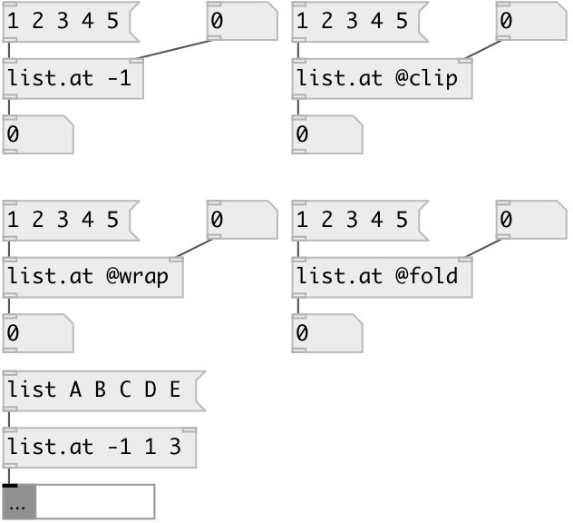

[index](index.html) :: [list](category_list.html)
---

# list.at

###### outputs list element(s) at specified index(es)

*available since version:* 0.1

---

## information
Returns the element at the given index position in the list.
@rel property allows to acess elements in range (-LIST_SIZE, LIST_SIZE). Negative
            index means position from the end of the list. For example: -1 returns last
            element.
@clip property: if element index &lt; 0 - first element returned. If element index
            &gt;= LIST_SIZE last element returned.
@wrap property: in range [0, LIST_SIZE) ordinal elements are returned. Other
            indexes are wrapped by modulo division.

## arguments:

* **position**
single or multiple elements position 
__type:__ list 

## properties:

* **@method** 
Get/set methods of processing of negative/invalid indexes 
__type:__ symbol 
__enum:__ rel, clip, fold, wrap 
__default:__ rel 

* **@rel** 
Get/set alias to @method rel. Negative index means position from the end of the list 
__type:__ alias 

* **@clip** 
Get/set alias to @method clip. If index &lt; 0 - return first element. If index greater or
equal list size - return last element 
__type:__ alias 

* **@fold** 
Get/set alias to @method fold. In range [0, LIST_SIZE) ordinal elements are returned.
[LIST_SIZE, 2*LIST_SIZE) - returned in negative order etc. 
__type:__ alias 

* **@wrap** 
Get/set alias to @method wrap. In range [0, LIST_SIZE) ordinal elements are returned.
Other indexes are wrapped by modulo division. 
__type:__ alias 

* **@index** 
Get/set indexes 
__type:__ list 
__default:__ 0 

* **@default** 
Get/set default output value if not found. If not set, outputs error message to console 
__type:__ atom 

## inlets:

* input list 
__type:__ control 
* positions 
__type:__ control 

## outlets:

* element(s) at the given index position(s). If element not found at specified
            position and @default property is set, output that default value
__type:__ control 

## keywords:

[list](keywords/list.html)

**See also:**
[\[list.^at\]](list.%5Eat.html)
[\[list.apply_to\]](list.apply_to.html)

**Authors:** Serge Poltavsky

**License:** GPL3 or later

