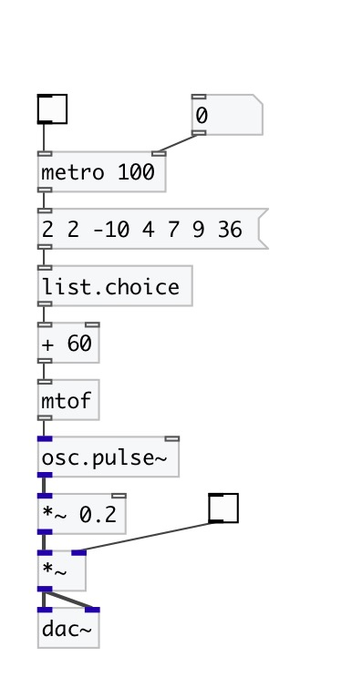

[index](index.html) :: [list](category_list.html)
---

# list.choice

###### outputs random element from list

*available since version:* 0.1

---

## properties:

* **@norepeat** 
Get/set norepeat property. If 1 is given: every time output value at new list position,
do not repeat choosed position twice at adjacent events. 
_type:_ bool 
_default:_ 0 

## inlets:

* Input list 
_type:_ control

## outlets:

* random list element 
_type:_ control

## keywords:

[list](keywords/list.html)
[random](keywords/random.html)
[choice](keywords/choice.html)

**See also:**
[\[random.int\]](random.int.html)

**Authors:** Serge Poltavsky

**License:** GPL3 or later

