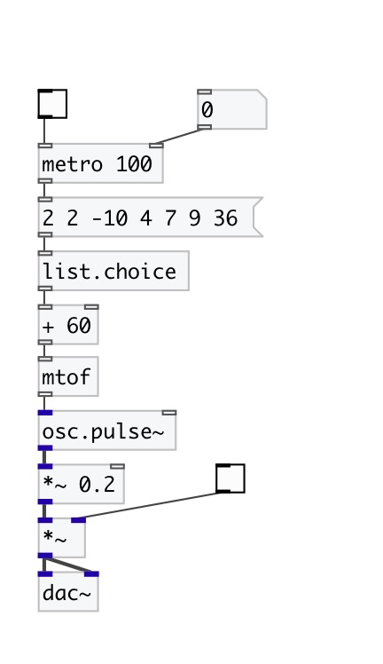

[< reference home](index.html)
---

# list.choice

returns random element from list

---

 

---

---
arguments:

---
properties:

@norepeat: norepeat property. If 1 is
            given: every time output value at new list position, do not repeat choosed position
            twice at adjacent events. 

---
see also: 

