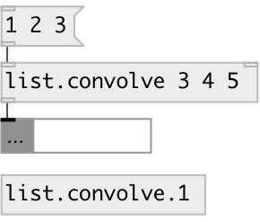

[index](index.html) :: [list](category_list.html)
---

# list.convolve
**aliases:** [list.conv]

###### convolution for lists

*available since version:* 0.9.4

---

## information
Note: may perform slowly in large lists because it does not use the FFT to compute the convolution

## arguments:

* **B**
second argument values 
_type:_ list 

## properties:

* **@a** 
Get/set first argument 
_type:_ list 

* **@b** 
Get/set second argument 
_type:_ list 

* **@mode** 
Get/set output mode. &#39;full&#39; - output the convolution at each point of overlap, with an
output length of (M+N-1). At the end-points of the convolution, the signals do
not overlap completely, and boundary effects may be seen. &#39;valid&#39; - output of
length (max(M,N)-min(M,N)+1). The convolution product is only given for points
where the signals overlap completely. Values outside the signal boundary have
no effect. &#39;same&#39; - output of length max(M,N). Boundary effects are still
visible 
_type:_ symbol 
_enum:_ valid, same, full 
_default:_ full 

* **@valid** 
Get/set alias to @mode valid 
_type:_ alias 

* **@same** 
Get/set alias to @mode same 
_type:_ alias 

* **@full** 
Get/set alias to @mode full 
_type:_ alias 

## inlets:

* calculate convolution and output 
_type:_ control
* set second argument (@b property) 
_type:_ control

## outlets:

* list: output result 
_type:_ control

## keywords:

[list](keywords/list.html)
[convolve](keywords/convolve.html)
[convolution](keywords/convolution.html)

**Authors:** Serge Poltavsky

**License:** GPL3 or later

