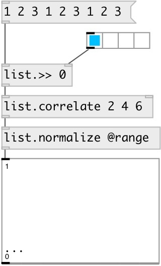

[index](index.html) :: [list](category_list.html)
---

# list.correlate

###### list cross-correlation

*available since version:* 0.9.4

---

## information
Note: may perform slowly in large lists because it does not use the FFT to compute
            the convolution

## arguments:

* **B**
second argument values 
__type:__ list 

## properties:

* **@a** 
Get/set first argument 
__type:__ list 

* **@b** 
Get/set second argument 
__type:__ list 

* **@mode** 
Get/set output mode. &#39;full&#39; - output the cross-correlation at each point of overlap,
with an output length of (M+N-1). At the end-points of the cross-correlation,
the signals do not overlap completely, and boundary effects may be seen.
&#39;valid&#39; - output of length (max(M,N)-min(M,N)+1). The cross-correlation product
is only given for points where the signals overlap completely. Values outside
the signal boundary have no effect. &#39;same&#39; - output of length max(M,N).
Boundary effects are still visible 
__type:__ symbol 
__enum:__ valid, same, full 
__default:__ valid 

* **@valid** 
Get/set alias to @mode valid 
__type:__ alias 

* **@same** 
Get/set alias to @mode same 
__type:__ alias 

* **@full** 
Get/set alias to @mode full 
__type:__ alias 

## inlets:

* calculate cross-correlation and output 
__type:__ control 
* set second argument (@b property) 
__type:__ control 

## outlets:

* list: output result
__type:__ control 

## keywords:

[list](keywords/list.html)
[correlation](keywords/correlation.html)
[cross](keywords/cross.html)

**Authors:** Serge Poltavsky

**License:** GPL3 or later

