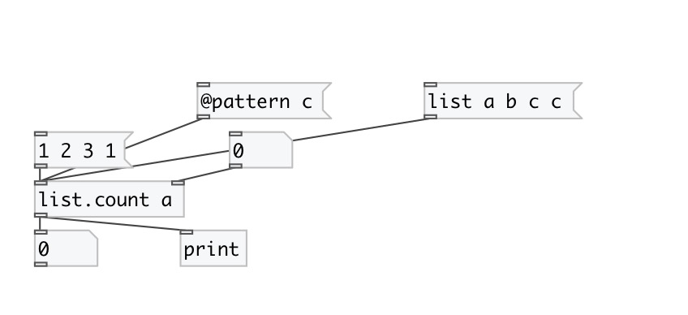
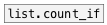

[< reference home](index.html)
---

# list.count

returns the number of items that equal to specified value

---

 

---

---
arguments:

pattern: count pattern value 

---
properties:

@pattern: new pattern value 

---
see also: 

