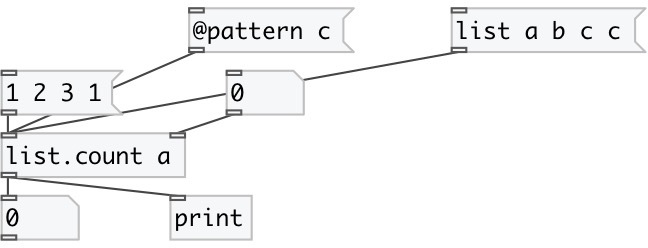

[index](index.html) :: [list](category_list.html)
---

# list.count

###### output the number of items that equal to specified value

*available since version:* 0.1

---

## arguments:

* **pattern**
count pattern value 
__type:__ any 

## properties:

* **@pattern** 
Get/set new pattern value 
__type:__ atom 

## inlets:

* Input list 
__type:__ control 
* change pattern value 
__type:__ control 

## outlets:

* count of found elements
__type:__ control 

## keywords:

[list](keywords/list.html)
[count](keywords/count.html)

**See also:**
[\[list.count_if\]](list.count_if.html)

**Authors:** Serge Poltavsky

**License:** GPL3 or later

