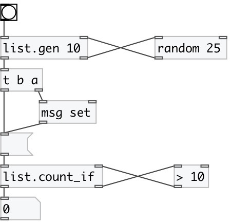

[index](index.html) :: [list](category_list.html)
---

# list.count_if

###### output the number of items that satisfy to external predicate

*available since version:* 0.1

---

## inlets:

* input list 
_type:_ control
* input value from predicate. &#34;1&#34; means accepted. &#34;0&#34; means reject 
_type:_ control

## outlets:

* count of elements 
_type:_ control
* element output to predicate 
_type:_ control

## keywords:

[list](keywords/list.html)
[count](keywords/count.html)

**See also:**
[\[list.count\]](list.count.html)

**Authors:** Serge Poltavsky

**License:** GPL3 or later

