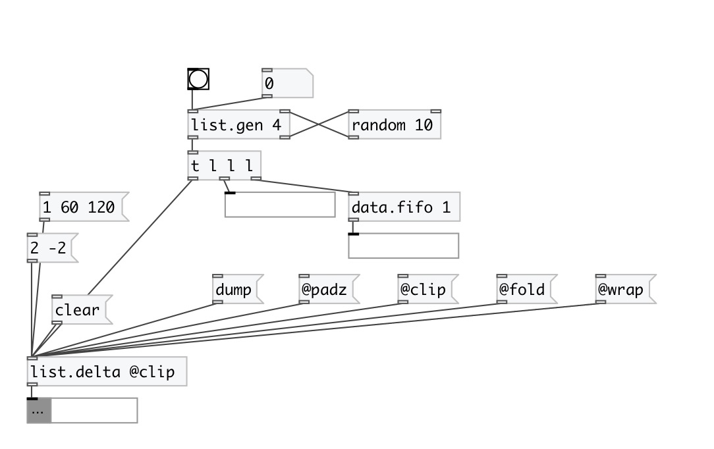

[index](index.html) :: [list](category_list.html)
---

# list.delta

###### returns the difference between the current list of floats and the previous one.

*available since version:* 0.1

---

## methods:

* **clear**
sets to empty list current state 

## properties:

* **@oversize** 
Get/set behavior, if list have different sizes 
_type:_ symbol 
_enum:_ min, padz, clip, wrap, fold 
_default:_ padz 

* **@min** 
Get/set alias for &#34;@oversize min&#34; property. Truncates lists to minimal common size 
_type:_ alias 

* **@clip** 
Get/set alias for &#34;@oversize min&#34; property. Truncates lists to minimal common size. 
_type:_ alias 

* **@padz** 
Get/set alias for &#34;@oversize padz&#34; property. Pad shortest list with zeroes. 
_type:_ alias 

* **@clip** 
Get/set alias for &#34;@oversize clip&#34; property. Pad shortest list with last element to
conform longest list 
_type:_ alias 

* **@wrap** 
Get/set alias for &#34;@oversize wrap&#34; property. Pad shortest list with repeated values
from the beginning. 
_type:_ alias 

* **@fold** 
Get/set alias for &#34;@oversize fold&#34; property. Pad shortest list with repeated values
from the end to the beginning, then back and so on. 
_type:_ alias 

## inlets:

* Input float list 
_type:_ control

## outlets:

* delta list 
_type:_ control

## keywords:

[list](keywords/list.html)
[delta](keywords/delta.html)

**See also:**
[\[list.integrator\]](list.integrator.html)

**Authors:** Alex Nadzharov, Serge Poltavsky

**License:** GPL3 or later

