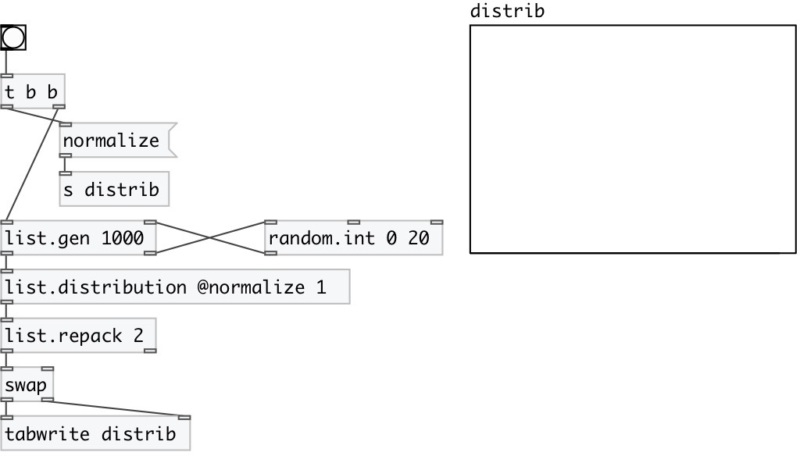

[index](index.html) :: [list](category_list.html)
---

# list.distribution

###### list value distribution

*available since version:* 0.1

---

## properties:

* **@normalize** 
Get/set normalize sum to 1 
_type:_ bool 
_default:_ 1 

## inlets:

* input list 
_type:_ control

## outlets:

* list of pairs: first element - value, second - number of repeats in list (by default normalized to have sum 1) 
_type:_ control

## keywords:

[list](keywords/list.html)
[distribution](keywords/distribution.html)

**Authors:** Serge Poltavsky

**License:** GPL3 or later

