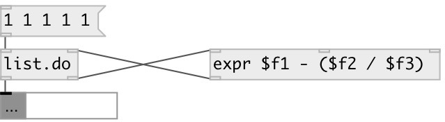

[index](index.html) :: [list](category_list.html)
---

# list.do

###### iterate and modify list contents via side-chain

*available since version:* 0.5

---

## inlets:

* input list 
_type:_ control
* processed atom from side-chain 
_type:_ control

## outlets:

* output processed list 
_type:_ control
* output per each list element: ATOM INDEX TOTAL 
_type:_ control

## keywords:

[list](keywords/list.html)
[iterate](keywords/iterate.html)

**See also:**
[\[list.each\]](list.each.html)

**Authors:** Alex Nadzharov

**License:** GPL3 or later

