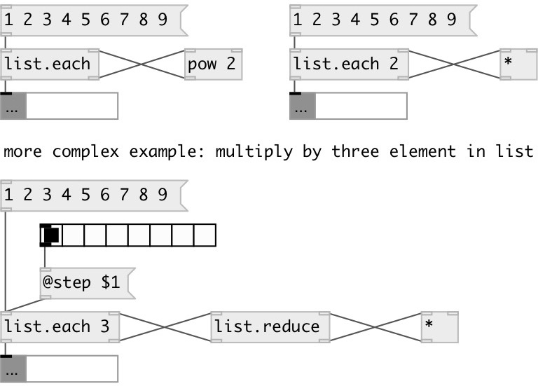

[index](index.html) :: [list](category_list.html)
---

# list.each

###### maps each list value via external side-chain

*available since version:* 0.1

---

## information
Each @step elements are passed via righmost outlet to extenal object, that suppose to return it back to rightmost inlet. So various mapping and filtering are possible.

## arguments:

* **STEP**
see @step property 
_type:_ int 

## properties:

* **@step** 
Get/set number of elements outputted to rightmost outlet on each iteration 
_type:_ int 
_range:_ 1..1024 
_default:_ 1 

## inlets:

* Input list 
_type:_ control
* New modified value from applied object. 
_type:_ control

## outlets:

* New modified list (or mlist) 
_type:_ control
* single element or list of values (if @step property &gt; 1) 
_type:_ control

## keywords:

[list](keywords/list.html)
[functional](keywords/functional.html)
[map](keywords/map.html)
[iterate](keywords/iterate.html)

**See also:**
[\[list.do\]](list.do.html)
[\[list.apply_to\]](list.apply_to.html)

**Authors:** Serge Poltavsky

**License:** GPL3 or later

