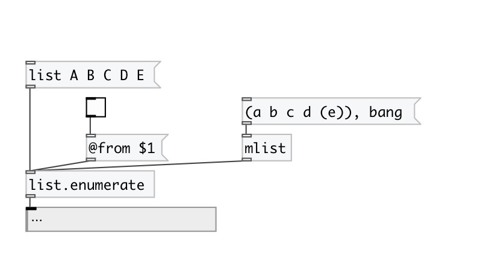

[< reference home](index.html)
---

# list.enumerate

enumerates input list

---

 

---

---
arguments:

---
properties:

@from: start enumeration index 
@append: put element index after element value 

