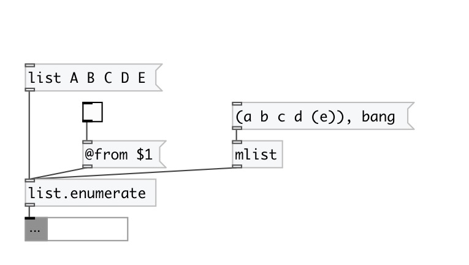

[index](index.html) :: [list](category_list.html)
---

# list.enumerate

###### enumerates list elements

*available since version:* 0.3

---

## arguments:

* **FROM**
enumeration start index 
_type:_ int 

## properties:

* **@append** (initonly)
Get/set put element index after element value 
_type:_ flag 
_default:_ 0 

* **@from** 
Get/set enumeration start index 
_type:_ int 
_default:_ 0 

## inlets:

* input list 
_type:_ control

## outlets:

* output list 
_type:_ control

## keywords:

[list](keywords/list.html)
[enumerate](keywords/enumerate.html)

**Authors:** Serge Poltavsky

**License:** GPL3 or later

