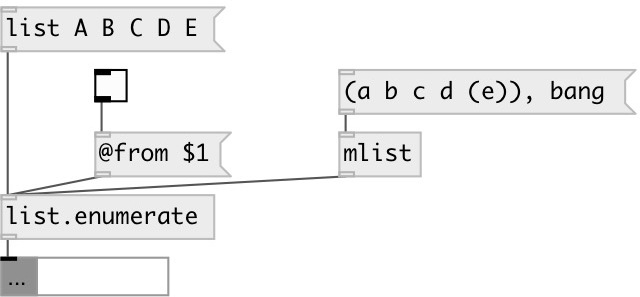

[index](index.html) :: [list](category_list.html)
---

# list.enumerate

###### enumerates input list

*available since version:* 0.3

---

## properties:

* **@from** 
Get/set start enumeration index 
__type:__ int 
__default:__ 0 

* **@append** 
Get/set put element index after element value 
__type:__ flag 
__default:__ 0 

## inlets:

* input list 
__type:__ control 

## outlets:

* output list
__type:__ control 

## keywords:

[list](keywords/list.html)
[enumerate](keywords/enumerate.html)

**Authors:** Serge Poltavsky

**License:** GPL3 or later

