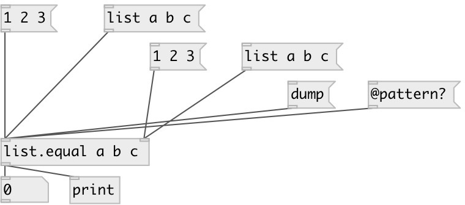

[index](index.html) :: [list](category_list.html)
---

# list.equal

###### checks if given lists are equal

*available since version:* 0.1

---

## arguments:

* **LIST**
initial value 
_type:_ list 

## methods:

* **dump**
dumps object state to PD console window 

## properties:

* **@pattern** 
Get/set current pattern 
_type:_ list 

## inlets:

* First list 
_type:_ control
* Second list 
_type:_ control

## outlets:

* &#34;1&#34; if lists are equal, &#34;0&#34; otherwise 
_type:_ control

## keywords:

[list](keywords/list.html)
[compare](keywords/compare.html)
[equal](keywords/equal.html)

**Authors:** Serge Poltavsky

**License:** GPL3 or later

