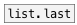

[<<< reference home](ceammc_lib.md)
---

# list.first

```


[-11 60 12( [list a b( [F]
|           |          |
[list.first            ]
|
[msg set]
|
[ (

            
```
---
returns first list element
---
arguments:


---
properties:


---
see also:<br>
[](list.last.md)
[](list.at.md)
