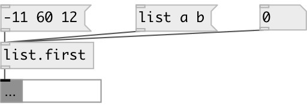

[index](index.html) :: [list](category_list.html)
---

# list.first

###### returns first list element

*available since version:* 0.1

---

## inlets:

* input list 
__type:__ control 

## outlets:

* first list element
__type:__ control 

## keywords:

[list](keywords/list.html)
[first](keywords/first.html)

**See also:**
[\[list.last\]](list.last.html)
[\[list.at\]](list.at.html)

**Authors:** Serge Poltavsky

**License:** GPL3 or later

