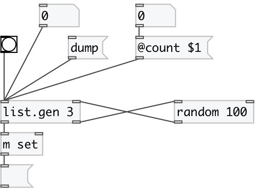

[index](index.html) :: [list](category_list.html)
---

# list.gen

###### generates list of specified length via external generator

*available since version:* 0.1

---

## information
Note, that maximum length limited to 1024 elements.

## arguments:

* **COUNT**
length of generated list 
_type:_ int 

## methods:

* **dump**
dump internal object state to Pd console window 

## properties:

* **@count** 
Get/set length of generated list 
_type:_ int 
_range:_ 1..1024 
_default:_ 1 

## inlets:

* starts list generation 
_type:_ control
* input for generated values 
_type:_ control

## outlets:

* generated list 
_type:_ control
* bang output for generator object 
_type:_ control

## keywords:

[list](keywords/list.html)
[generate](keywords/generate.html)

**See also:**
[\[list.seq\]](list.seq.html)
[\[list.shuffle\]](list.shuffle.html)
[\[list.choice\]](list.choice.html)

**Authors:** Serge Poltavsky

**License:** GPL3 or later

