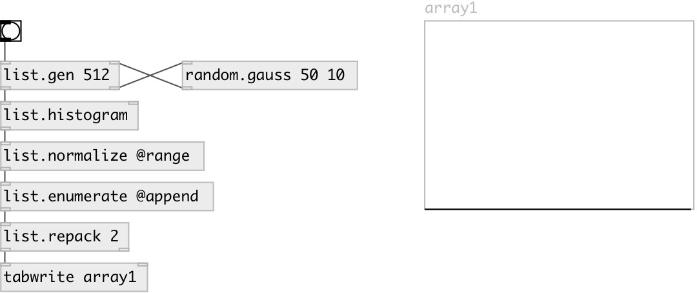

[index](index.html) :: [list](category_list.html)
---

# list.histogram

###### outputs distribution histogram

*available since version:* 0.3

---

## information
Histogram outputted as list of probabilities in specified number of bins

## arguments:

* **BINS**
number of histogram bins 
_type:_ int 

## properties:

* **@bins** 
Get/set number of histogram bins 
_type:_ int 
_range:_ 2..1024 
_default:_ 100 

## inlets:

* input list 
_type:_ control
* set number of bins 
_type:_ control

## outlets:

* output list - length of @bins 
_type:_ control

## keywords:

[list](keywords/list.html)
[histogram](keywords/histogram.html)

**Authors:** Serge Poltavsky

**License:** GPL3 or later

