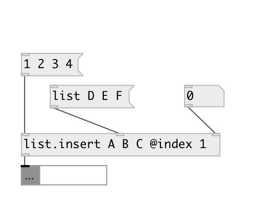

[index](index.html) :: [list](category_list.html)
---

# list.insert

###### insert atom or list to the specified position of input list

*available since version:* 0.6

---

## information
Works with data atoms

## arguments:

* **LIST**
list content 
_type:_ list 

## properties:

* **@index** 
Get/set insert element index 
_type:_ int 
_min value:_ 0 
_default:_ 0 

* **@value** 
Get/set list contents 
_type:_ list 

## inlets:

* input list 
_type:_ control
* set inserted atom or list 
_type:_ control
* set insert position 
_type:_ control

## outlets:

* output result list or mlist 
_type:_ control

## keywords:

[list](keywords/list.html)
[insert](keywords/insert.html)

**See also:**
[\[list.append\]](list.append.html)
[\[list.prepend\]](list.prepend.html)

**Authors:** Serge Poltavsky

**License:** GPL3 or later

