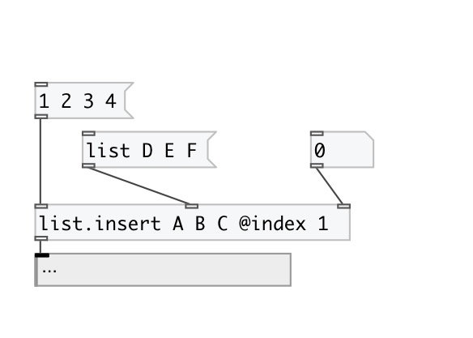
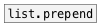

[< reference home](index.html)
---

# list.insert

insert atom or list to the specified position of input list

---

Works with data atoms
 

---

---
arguments:

---
properties:

@index: insert element
            index 

---
see also: 

