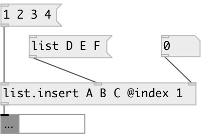

[index](index.html) :: [list](category_list.html)
---

# list.insert

###### insert atom or list to the specified position of input list

*available since version:* 0.6

---

## information
Works with data atoms

## arguments:

* **LIST**
list content 
__type:__ list 

## properties:

* **@index** 
Get/set insert element index 
__type:__ int 
__min value:__ 0 
__default:__ 0 

* **@value** 
Get/set list contents 
__type:__ list 

## inlets:

* input list 
__type:__ control 
* set inserted atom or list 
__type:__ control 
* set insert position 
__type:__ control 

## outlets:

* output result list or mlist
__type:__ control 

## keywords:

[list](keywords/list.html)
[insert](keywords/insert.html)

**See also:**
[\[list.append\]](list.append.html)
[\[list.prepend\]](list.prepend.html)

**Authors:** Serge Poltavsky

**License:** GPL3 or later

