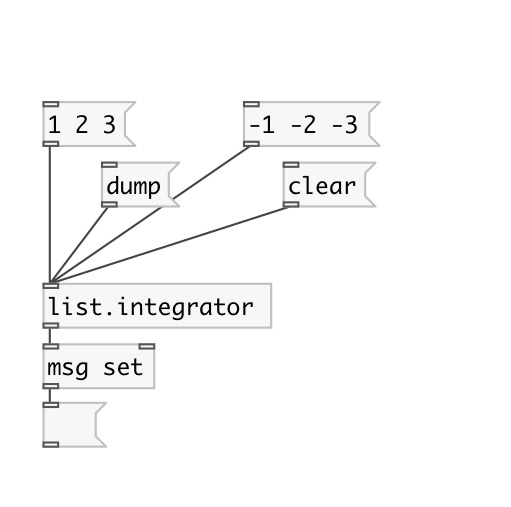
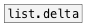

[< reference home](index.html)
---

# list.integrator

returns the sum of the previously stored list and the current one then
            stores this sum

---

 

---

---
arguments:

---
properties:

@oversize: 
            behavior, if list have different sizes 
@min: alias for &#34;@oversize min&#34; property. Truncates lists
            to minimal common size 
@clip: alias for &#34;@oversize min&#34; property. Truncates lists
            to minimal common size. 
@padz: alias for &#34;@oversize padz&#34; property. Pad shortest
            list with zeroes. 
@clip: alias for &#34;@oversize clip&#34; property. Pad shortest
            list with last element to conform longest list 
@wrap: alias for &#34;@oversize wrap&#34; property. Pad shortest
            list with repeated values from the beginning. 
@fold: alias for &#34;@oversize fold&#34; property. Pad shortest
            list with repeated values from the end to the beginning, then back and so
            on. 

---
see also: 

