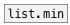

[< reference home](ceammc_lib.html)
---

# list.max


returns largest element in the list

---

By default returns largest float in list, this equal to using @float
            property.
Also you can choose largest symbol from list, using @symbol property.
<br>


---


```


[1 2 3 a b(  [list a b c(  [1 2 3 a b(  [list a aa ab ac(
|            |             |            |
|            |             |            |
[list.max @float]          [list.max @symbol]
|                          |
[F]                        [S digits=10]

[1 a 2 b 3 c( [F]    [S digits=8]
|             |      |
|             |      |
[list.max @any       ]
|
[msg set]
|
[ (

            
```

---
arguments:


---
properties:

@type: type of
            largest element<br>
@float: alias for @type float. Find max float element in
            list<br>
@symbol: alias for @type symbol. Find greatest symbol
            element<br>
@any: alias for @type any. Find greatest atom of any type.
            Note: symbols are greater then numbers<br>

---
see also:<br>
[](list.min.html)
