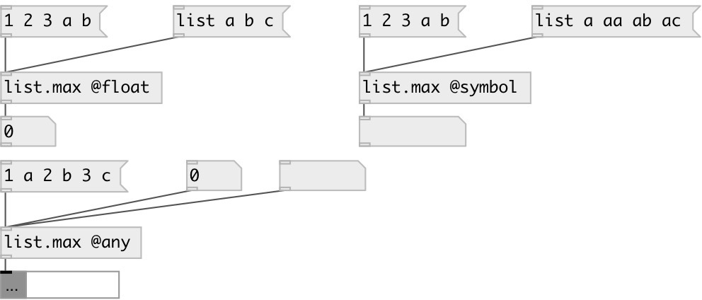

[index](index.html) :: [list](category_list.html)
---

# list.max

###### output the largest list element

*available since version:* 0.1

---

## information
By default returns largest float in list, this equal to using @float property. Also you can choose largest symbol from list, using @symbol property.

## properties:

* **@any** 
Get/set alias for @type any. Find greatest atom of any type. Note: symbols are greater
then numbers 
_type:_ alias 

* **@float** 
Get/set alias for @type float. Find max float element in list 
_type:_ alias 

* **@symbol** 
Get/set alias for @type symbol. Find greatest symbol element 
_type:_ alias 

* **@type** 
Get/set type of largest element 
_type:_ symbol 
_enum:_ float, symbol, any 
_default:_ float 

## inlets:

* input list 
_type:_ control

## outlets:

* largest element 
_type:_ control

## keywords:

[list](keywords/list.html)
[max](keywords/max.html)
[compare](keywords/compare.html)

**See also:**
[\[list.min\]](list.min.html)

**Authors:** Serge Poltavsky

**License:** GPL3 or later

