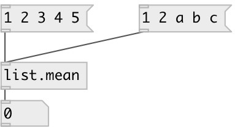

[index](index.html) :: [list](category_list.html)
---

# list.mean
**aliases:** [list.average]

###### calculates average of list of floats

*available since version:* 0.1

---

## inlets:

* input list of floats. Non float values are just ignored. No output if no floats in list 
_type:_ control

## outlets:

* average (float) 
_type:_ control

## keywords:

[list](keywords/list.html)
[mean](keywords/mean.html)

**See also:**
[\[list.normalize\]](list.normalize.html)

**Authors:** Serge Poltavsky

**License:** GPL3 or later

