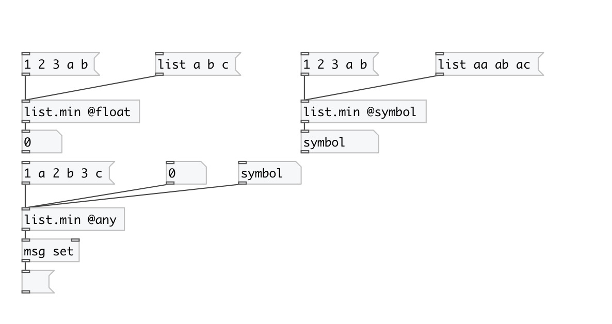
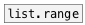

[< reference home](index.html)
---

# list.min

returns smallest element in the list

---

By default returns smallest float in list, this equal to using @float
            property.
Also you can choose smallest symbol from list by using @symbol property.
 

---

---
arguments:

---
properties:

@type: type of
            largest element 
@float: alias for @type float. Find max float element in
            list 
@symbol: alias for @type symbol. Find greatest symbol
            element 
@any: alias for @type any. Find greatest atom of any type.
            Note: symbols are greater then numbers 

---
see also: 

