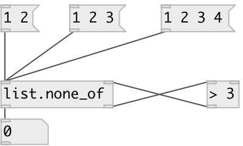

[index](index.html) :: [list](category_list.html)
---

# list.none_of

###### checks if none of list atoms is accepted by predicate

*available since version:* 0.1

---

## inlets:

* Input list 
_type:_ control
* input value from predicate. &#34;1&#34; means accepted. &#34;0&#34; means reject. 
_type:_ control

## outlets:

* 1 - if predicate object returns true for all the elements or list is empty or 0 otherwise. 
_type:_ control
* atom to predicate 
_type:_ control

## keywords:

[list](keywords/list.html)
[predicate](keywords/predicate.html)
[none](keywords/none.html)

**See also:**
[\[list.all_of\]](list.all_of.html)
[\[list.any_of\]](list.any_of.html)

**Authors:** Serge Poltavsky

**License:** GPL3 or later

