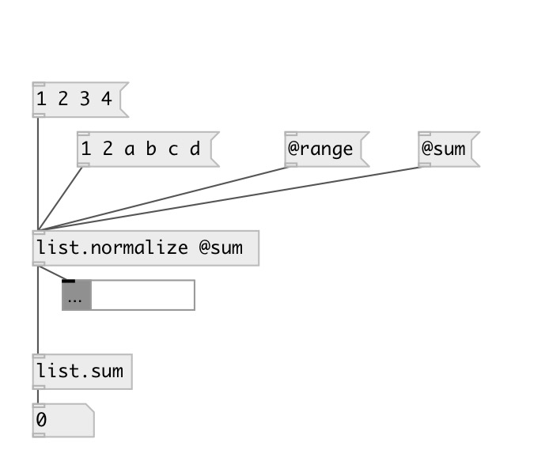

[index](index.html) :: [list](category_list.html)
---

# list.normalize

###### normalizes float list values to get their sum = 1.0

*available since version:* 0.1

---

## information
There are two modes of normalization:
1. by sum - multiply all elements to such number to get total sum = 1.0
2. by value range - maps all values to range 0..1 lineary

## properties:

* **@by** 
Get/set normalization mode 
__type:__ symbol 
__enum:__ sum, range 
__default:__ sum 

* **@sum** 
Get/set alias to @by sum 
__type:__ alias 

* **@range** 
Get/set alias to @by range 
__type:__ alias 

## inlets:

* input list of floats. Non float values are rejected 
__type:__ control 

## outlets:

* output list
__type:__ control 

## keywords:

[list](keywords/list.html)
[normalize](keywords/normalize.html)

**Authors:** Serge Poltavsky

**License:** GPL3 or later

