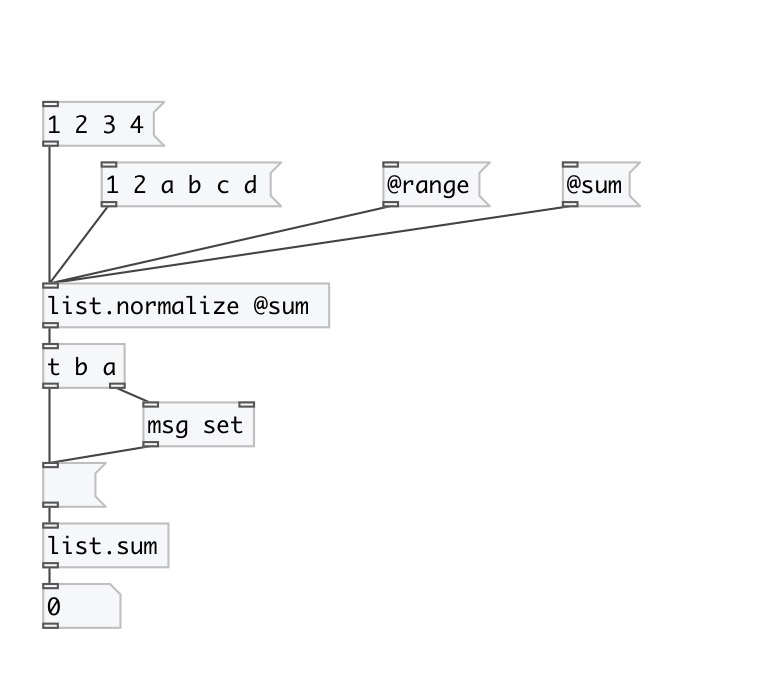

[< reference home](index.html)
---

# list.normalize

normalizes float list values to get their sum = 1.0

---

There are two modes of normalization:
1. by sum - multiply all elements to such number to get total sum = 1.0
2. by value range - maps all values to range 0..1 lineary
 

---

---
arguments:

---
properties:

@by: normalization
            mode 
@sum: alias to @by sum 
@range: alias to @by range 

