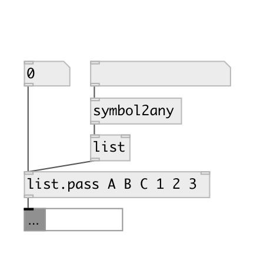

[index](index.html) :: [list](category_list.html)
---

# list.pass

###### leave in list only specified elements

*available since version:* 0.9.5

---

## arguments:

* **ARGS**
list of passed value 
_type:_ list 

## properties:

* **@args** 
Get/set list of passed value 
_type:_ list 

## inlets:

* input float 
_type:_ control
* set passed values 
_type:_ control

## outlets:

* output list with passed elements 
_type:_ control

## keywords:

[list](keywords/list.html)
[pass](keywords/pass.html)
[filter](keywords/filter.html)

**See also:**
[\[list.pass_if\]](list.pass_if.html)

**Authors:** Serge Poltavsky

**License:** GPL3 or later

