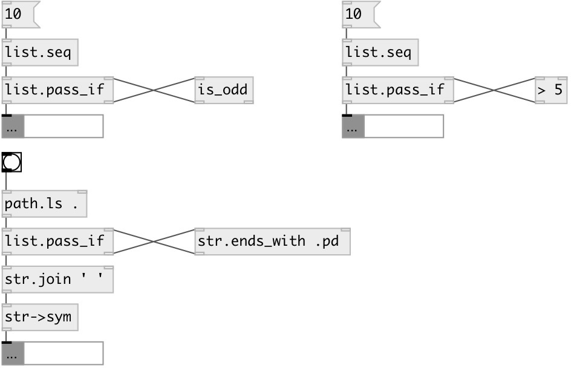

[index](index.html) :: [list](category_list.html)
---

# list.pass_if
**aliases:** [list.filter]

###### leave only elements accepted by predicate

*available since version:* 0.3

---

## information
Predicate object should accept atom and output 0 (remove element) or 1 (leave element).

## inlets:

* input list 
_type:_ control
* value from predicate 
_type:_ control

## outlets:

* output list with accepted elements 
_type:_ control
* atom to predicate 
_type:_ control

## keywords:

[list](keywords/list.html)
[pass](keywords/pass.html)
[accept](keywords/accept.html)
[leave](keywords/leave.html)
[predicate](keywords/predicate.html)

**See also:**
[\[list.remove_if\]](list.remove_if.html)

**Authors:** Serge Poltavsky

**License:** GPL3 or later

