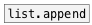

# list.prepend

```


[B] [F]  [B]    [1 2 3 4 5( [B]
|   |    |             |    |
|   |    [str test1]   |    [str ANOTHER STRING]
|   |    |             |    |
|   |    |             |    |.
[list.prepend @prop ABC       ]
|
[ui.display @display_type=1]

            
```
---
arguments:


---
properties:


see also:<br>

