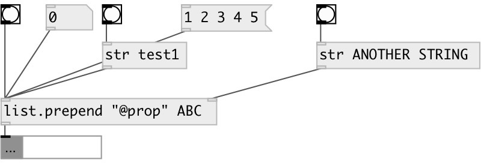

[index](index.html) :: [list](category_list.html)
---

# list.prepend

###### prepend atom or list before input list

*available since version:* 0.6

---

## information
Works with data atoms

## arguments:

* **VALUE**
prepend values 
_type:_ list 

## properties:

* **@value** 
Get/set prepend values 
_type:_ list 

## inlets:

* treated as empty input list 
_type:_ control
* set prepended atom or list 
_type:_ control

## outlets:

* output concatenated list 
_type:_ control

## keywords:

[list](keywords/list.html)
[prepend](keywords/prepend.html)

**See also:**
[\[list.append\]](list.append.html)

**Authors:** Serge Poltavsky

**License:** GPL3 or later

