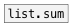

[<<< reference home](ceammc_lib.md)
---

# list.product

```


[1 2 3 4 5 -6(   [1 2 a b c(
|                |
|  [1 2 3(       |
|  |             |
|  |             |
[list.product    ]
|
[F]

            
```
---
calculates product of floats in list
---
arguments:


---
properties:


---
see also:<br>
[](list.sum.md)
