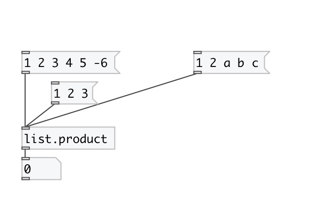

[< reference home](index.html)
---

# list.product

calculates product of floats in list

---

Note: symbol values are treated as 0. So if list contains at least one symbol,
            product will be always equal to zero
 

---

---
arguments:

---
properties:

---
see also: 

