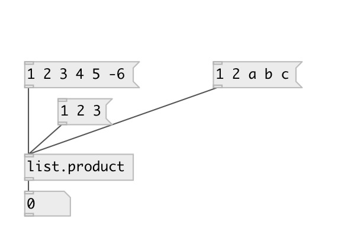

[index](index.html) :: [list](category_list.html)
---

# list.product

###### calculates product of floats in list

*available since version:* 0.1

---

## information
Note: symbol values are treated as 0. So if list contains at least one symbol,
            product will be always equal to zero

## inlets:

* input list 
_type:_ control

## outlets:

* float list product 
_type:_ control

## keywords:

[list](keywords/list.html)
[product](keywords/product.html)

**See also:**
[\[list.sum\]](list.sum.html)

**Authors:** Serge Poltavsky

**License:** GPL3 or later

