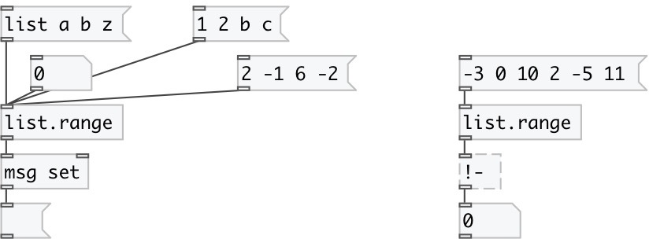

[index](index.html) :: [list](category_list.html)
---

# list.range

###### output list smallest and largest value

*available since version:* 0.1

---

## information
Note: numbers are smaller then symbols

## inlets:

* input list 
__type:__ control 

## outlets:

* list of two elements: first is a smallest values, second - largest
__type:__ control 

## keywords:

[list](keywords/list.html)
[range](keywords/range.html)
[compare](keywords/compare.html)

**See also:**
[\[list.min\]](list.min.html)
[\[list.max\]](list.max.html)

**Authors:** Serge Poltavsky

**License:** GPL3 or later

