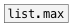

[< reference home](ceammc_lib.html)
---

# list.range


returns list smallest and largest value

```


[list a b z( [1 2 b c(
|            |
| [F]        |  [2 -1 6 -2(    [-3 0 10 2 -5 11(
| |          |  |              |
[list.range     ]              [list.range     ]
|                              |
[msg set]                      [!-]
|                              |
[ (                            [F]

            
```

---
arguments:


---
properties:


---
see also:<br>
[](list.min.html)
[](list.max.html)
