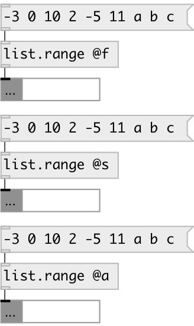

[index](index.html) :: [list](category_list.html)
---

# list.range
**aliases:** [list.minmax]

###### output list smallest and largest value

*available since version:* 0.1

---

## information
Note: if @type = any, numbers are smaller then symbols

## properties:

* **@type** 
Get/set type of accepted atoms 
_type:_ symbol 
_enum:_ float, symbol, any 
_default:_ float 

* **@f** 
Get/set alias to @type float, accept only floats 
_type:_ alias 

* **@s** 
Get/set alias to @type symbol, accept only symbols 
_type:_ alias 

* **@a** 
Get/set alias to @type any, accept all 
_type:_ alias 

## inlets:

* input list 
_type:_ control

## outlets:

* list of two elements: first is a smallest value, second - largest 
_type:_ control

## keywords:

[list](keywords/list.html)
[range](keywords/range.html)
[compare](keywords/compare.html)

**See also:**
[\[list.min\]](list.min.html)
[\[list.max\]](list.max.html)

**Authors:** Serge Poltavsky

**License:** GPL3 or later

