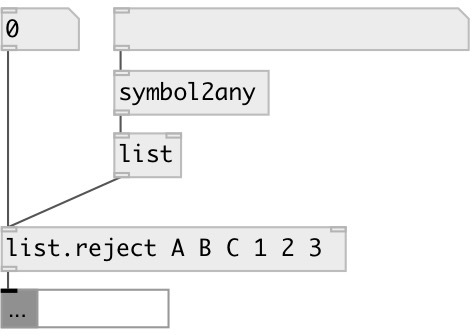

[index](index.html) :: [list](category_list.html)
---

# list.reject

###### remove specified element from list

*available since version:* 0.9.5

---

## arguments:

* **ARGS**
list of rejected values 
_type:_ list 

## properties:

* **@args** 
Get/set list of rejected values 
_type:_ list 

## inlets:

* input float 
_type:_ control
* set rejected values 
_type:_ control

## outlets:

* list without rejected elements 
_type:_ control

## keywords:

[list](keywords/list.html)
[pass](keywords/pass.html)
[reject](keywords/reject.html)

**See also:**
[\[list.reject_if\]](list.reject_if.html)

**Authors:** Serge Poltavsky

**License:** GPL3 or later

