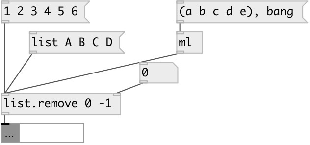

[index](index.html) :: [list](category_list.html)
---

# list.remove

###### remove list element(s) at specified positions

*available since version:* 0.6

---

## arguments:

* **INDEXES**
list of indexes to remove. Negative indexes are also supported 
__type:__ list 

## properties:

* **@indexes** 
Get/set indexes to remove 
__type:__ list 

## inlets:

* input list 
__type:__ control 
* set remove indexes 
__type:__ control 

## outlets:

* output list
__type:__ control 

## keywords:

[list](keywords/list.html)
[remove](keywords/remove.html)

**See also:**
[\[list.insert\]](list.insert.html)

**Authors:** Serge Poltavsky

**License:** GPL3 or later

