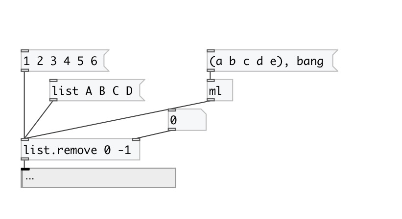

[< reference home](index.html)
---

# list.remove

on input list remove element(s) at specified positions

---

 

---

---
arguments:

INDEXES: list of indexes to remove. Negative indexes are
            also supported 

---
properties:

---
see also: 

